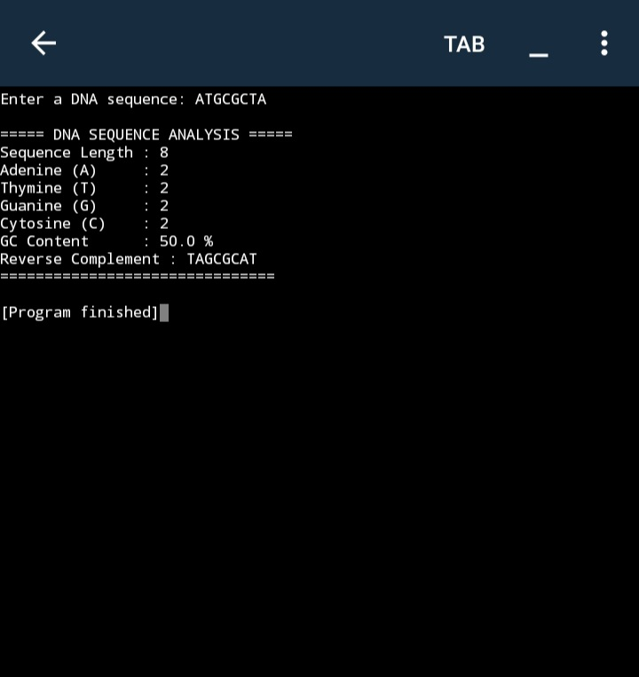

# 🧬 DNA Sequence Analyzer

A Python-based DNA Sequence Analyzer developed as part of my Computational Biology learning journey. This project applies fundamental Python programming to biological sequence analysis by validating DNA sequences, calculating nucleotide composition, computing GC content, and generating reverse complements.

---

## 📖 Overview

This project was built to strengthen my understanding of both Python programming and molecular biology by applying code to real biological concepts. It marks the beginning of my exploration into computational biology and bioinformatics.

---

## ✨ Features

- ✅ Validates DNA sequences (A, T, G, C)
- ✅ Calculates sequence length
- ✅ Counts each nucleotide (A, T, G, C)
- ✅ Computes GC Content (%)
- ✅ Generates the reverse complement of a DNA sequence

---

## 🖥️ Example Output

---

## 🧬 Biological Concepts

This project demonstrates several foundational concepts in molecular biology:

- DNA nucleotide composition
- GC Content
- Complementary base pairing
- Reverse complement generation

---

## 💻 Technologies Used

- Python

---

## 🚀 Future Improvements

Planned future versions may include:

- DNA → RNA transcription
- DNA → Protein translation
- FASTA file support
- Sequence alignment
- Integration with NCBI databases
- Additional sequence statistics

---

## 🎯 Learning Outcomes

Through this project, I practiced:

- Python fundamentals
- String manipulation
- Conditional statements
- Loops
- Dictionaries
- Applying programming to biological sequence analysis

---

## 👩‍💻 Author

**Sara Jaiswal**
